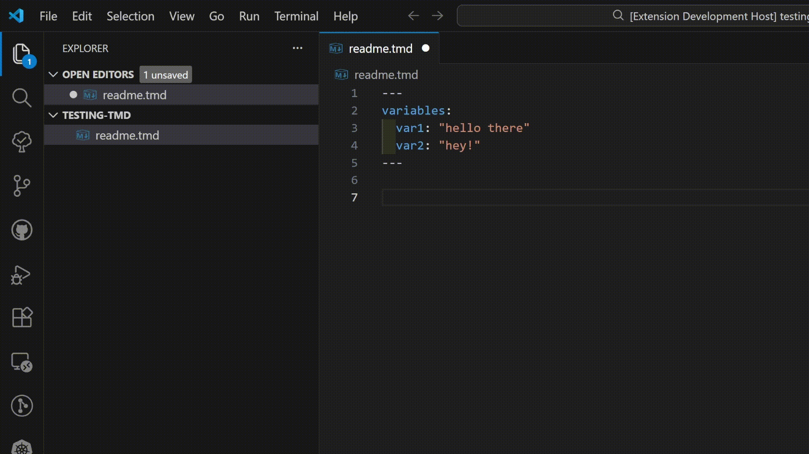

# TemplateMD

Write Markdown with Template.\
This is the official syntax highlighting support for TemplateMD.

To work with the syntax, you must install first the TemplateMD package from npm, then run it with `tmd --watch ./your/path/here`

## Features

- Write Markdown files with variables
- IntelliSense support

## Release Notes

### 1.0.0

Initial release of TemplateMD
